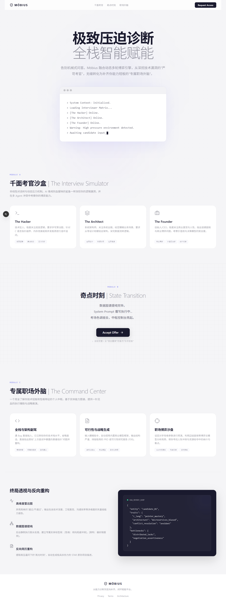
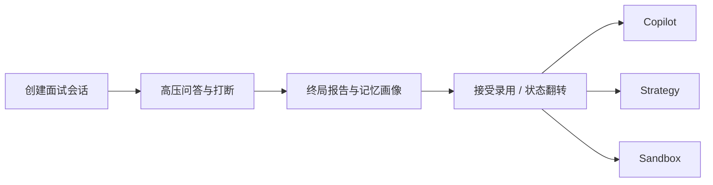
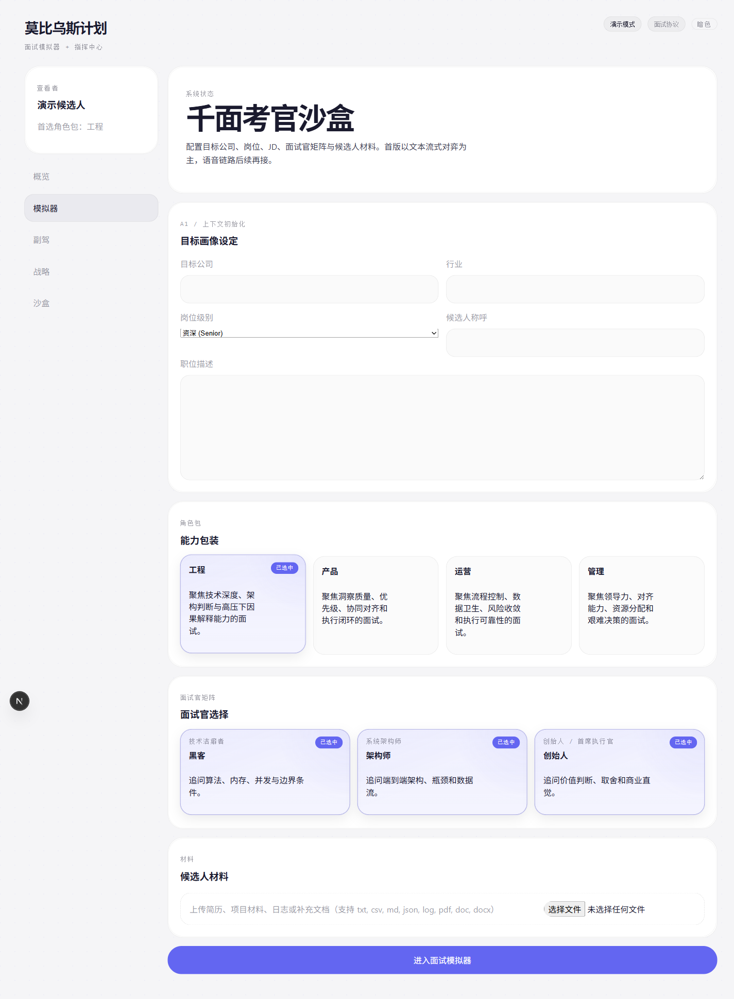
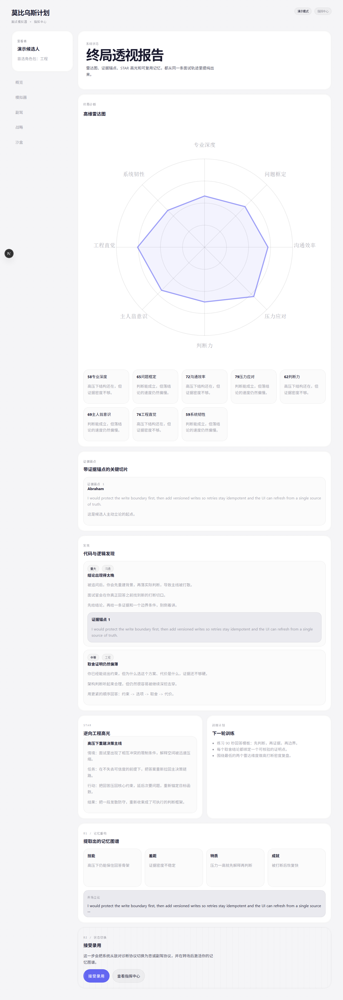
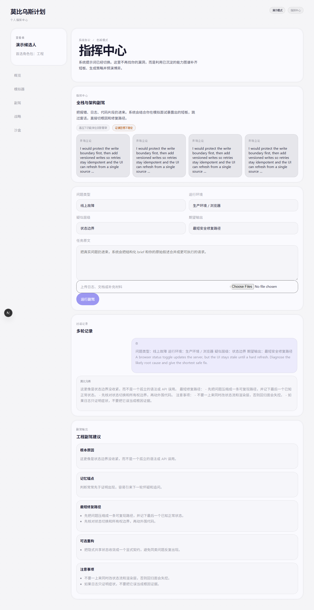

# 莫比乌斯计划 / anion

> 面向评审与汇报的产品说明文档
>
> 当前版本基于仓库原型整理，聚焦已验证能力与可见交互，不展开源码细节。

## 1. 项目简介

### 1.1 这个项目解决什么问题

莫比乌斯计划解决的不是“刷题”问题，而是中国科技从业者在高压面试和入职过渡阶段的两个连续问题：

- 面试准备阶段，传统题库和聊天机器人缺乏追问、打断、冲突和上下文，无法逼近真实面试压力。
- 面试结束之后，用户拿到的往往只是模糊反馈，无法沉淀成可复用的能力画像，更难继续转化为后续工作辅助。

因此，莫比乌斯计划把产品拆成一个连续闭环：

1. 用高压、多轮、可打断的面试模拟暴露问题。
2. 用结构化报告和记忆画像沉淀问题。
3. 把沉淀下来的上下文继续带入工程副驾、策略研究和博弈沙盒。

### 1.2 目标用户

- 准备高级 IC、架构、产品、运营、管理岗位面试的科技从业者
- 需要高频模拟、复盘和成长追踪的候选人
- 需要把“面试反馈”继续转化为后续工作辅助的人

### 1.3 当前痛点

- 题库式练习缺乏压迫感，无法暴露真正的临场短板
- 真人模拟成本高，反馈不稳定，难以持续复盘
- 一次面试结束后，洞察无法沉淀到后续工作流
- 通用 AI 问答工具很会“回答”，但不擅长持续追问、诊断和记忆

  

<em>图 1：品牌落地页。当前原型从一开始就把“高压诊断 -> 状态翻转 -> 指挥中心”作为统一叙事，而不是三个零散工具。</em>

## 2. 业务价值说明

### 2.1 对用户的实际意义

- 用户可以在低成本环境中反复经历接近真实的高压面试场景，而不是只看标准答案。
- 每次会话结束后，系统都会生成结构化诊断、证据锚点和记忆画像，帮助用户定位真正的薄弱项。
- 报告不是终点，同一份记忆上下文还可以继续进入副驾、战略、沙盒三种工作模式，形成持续价值。

### 2.2 对业务或产品侧的实际意义

- 一个系统同时覆盖“拉新试用、面试诊断、后续留存”三个阶段，天然比单点工具更有留存空间。
- `demo` 模式可零配置体验，降低首次试用门槛；`supabase` 模式可承接真实认证、持久化和后台任务。
- 记忆图谱让系统具备跨会话连续性，产品价值不再停留在单次回答，而能沉淀为长期上下文。

### 2.3 为什么值得做

从业务角度看，面试模拟类工具常见问题是“新鲜感强、复用率低”。莫比乌斯计划试图解决的核心不是再做一个更聪明的聊天面试官，而是把一次面试沉淀成后续工作辅助的输入，使产品从“单次练习工具”转向“长期个人外脑”。

## 3. AI 创新性说明

### 3.1 创新点一：三层面试引擎，而不是单层聊天

当前原型的核心创新不在“接了哪个大模型”，而在于把面试过程拆成三层：

- 第一层：确定性信号分析
  - 识别回答里的主题、因果链、证据质量、矛盾风险和废话倾向
- 第二层：导演动作规划
  - 决定由谁继续发问、是否打断、是否触发冲突、压力值如何变化
- 第三层：AI 结构化生成
  - 基于前两层上下文生成结构化追问或冲突事件

这意味着 AI 不再直接“自由聊天”，而是在规则和状态机约束下输出结构化事件，从而提升稳定性与可控性。

### 3.2 创新点二：面试结果会沉淀成记忆图谱

系统不会把一次面试当作一次性会话。面试完成后，会继续生成：

- 诊断报告
- 记忆画像
- 记忆证据条目
- 可选 embeddings，用于后续检索和关联

这让后续工作台不需要从零开始重新理解用户，而是可以继承“这位用户在压力下暴露过哪些问题、擅长什么、容易在哪些点失误”。

### 3.3 创新点三：从“找漏洞”翻转为“补短板”

莫比乌斯计划的重要产品创新，是把面试阶段和后续辅助阶段看成一个连续状态转换：

- 前半段，系统以严苛面试官视角施压
- 后半段，系统基于同一份诊断结果切换为辅助者视角

这不是简单的页面跳转，而是产品目标的翻转：从暴露问题，转向修复问题。

### 3.4 当前原型中已验证的 AI 能力边界

- 支持 2 种运行模式：`demo`、`supabase`
- 支持 4 个角色包：工程、产品、运营、管理
- 每个角色包当前实现 3 位面试官配置
- 报告结构要求至少 8 个评分维度
- 指挥中心当前实现 3 种模式：`copilot`、`strategy`、`sandbox`
- AI provider 选择顺序当前为：Anthropic -> OpenAI -> mock

这些都是当前仓库中可以直接从类型、逻辑或页面结构验证到的能力，不依赖宣传口径。

## 4. 技术实现说明

### 4.1 整体实现思路

项目采用 Next.js 16 App Router 作为宿主框架，业务逻辑围绕三条主线展开：

- 运行时模式切换
- AI 适配层
- 面试到报告再到指挥中心的状态流转

### 4.2 双运行模式

当前实现支持两种运行模式：

| 模式 | 用途 | 核心特点 |
|------|------|----------|
| `demo` | 快速体验与演示 | 内存存储、mock AI、无需真实登录 |
| `supabase` | 真实后端模式 | 认证、持久化存储、文件上传、后台任务 |

这种设计让产品既能低门槛演示，也能逐步接入真实业务环境。

### 4.3 AI 与数据层的高层结构

- 前端与路由层：Next.js 16 + React 19
- 类型与边界校验：Zod
- 数据层：`DataStore` 抽象，对应内存实现和 Supabase 实现
- AI 层：统一适配 Anthropic / OpenAI / mock provider
- 异步分析：Trigger.dev 可选，未启用时回退为进程内分析

### 4.4 技术上如何完成一次闭环

一次完整闭环的大致过程如下：

1. 用户在 `/simulator/new` 配置面试上下文。
2. 面试页面以流式方式接收面试事件，并动态更新压力值与发问者。
3. 会话结束后，系统生成诊断报告和记忆画像。
4. 报告结果通过 `/report/[sessionId]` 承接。
5. 用户进入 `/hub/*` 工作台时，系统把活跃记忆上下文注入后续模式。

### 4.5 为什么不需要在文档里展开源码细节

本次文档目标是说明“系统怎样工作”，而不是解释每个函数怎样写。对评审而言，关键是理解：

- 这是不是一个真实可运行的产品原型
- AI 在这里承担了什么角色
- 哪些能力已经落地到结构和交互中

因此，本节只保留架构思路和关键模块，不展开源码级实现。

## 5. 交互与设计说明

### 5.1 关键交互流程

当前原型的核心交互链路可以概括为四步：

1. 进入品牌落地页，理解产品叙事和模块关系
2. 在面试配置页设置目标岗位、角色包、面试官矩阵和材料
3. 进入实时对话页，经历追问、打断和压力变化
4. 在报告页查看诊断结果，并进入指挥中心延续后续价值

### 5.2 设计思路

- 落地页承担“产品叙事”职责，帮助用户先理解这是一个从对抗到协作翻转的系统
- 面试配置页强调结构化输入，减少无关噪音
- 面试页以高压对话为中心，突出角色、压力值、追问和打断
- 报告页与指挥中心页则从视觉上转向“分析”和“行动建议”，形成状态翻转

### 5.3 关键界面说明

#### A. 品牌与入口页 `/landing`

- 作用：建立产品叙事，让用户快速理解三段式结构
- 设计重点：不是罗列功能，而是把“施压、诊断、翻转”做成一条连续故事线

  

<em>图 2：落地页负责建立叙事和模块关系，降低首次理解成本。</em>

#### B. 面试配置页 `/simulator/new`

- 作用：把面试目标、角色包、面试官矩阵和候选人材料结构化输入系统
- 设计重点：先定义上下文，再进入高压问答，避免直接进入无约束聊天

  

<em>图 3：面试配置页把公司、级别、角色包、面试官和材料收敛为结构化上下文。</em>

#### C. 报告页 `/report/[sessionId]`

- 作用：承接面试输出，展示评分、证据和后续动作
- 设计重点：不只给结论，还要把“为什么这么判断”显式化，便于复盘和后续引用

  

<em>图 4：终局报告页承接面试结果，把结果转化为可复盘、可引用、可延续的结构化输出。</em>

#### D. 指挥中心 `/hub/*`

- 作用：承接活跃记忆上下文，把一次面试沉淀转化为后续执行辅助
- 设计重点：不是重新开始对话，而是延续上一阶段已经提取出的画像与证据

  

<em>图 5：指挥中心继续利用同一份记忆上下文，把诊断结果转入工程、战略或博弈场景。</em>

## 6. 实际演示视频

> 当前状态：视频待补充。

为避免伪造链接，本版文档只保留视频占位，不放置虚假入口。最终发布时，建议在本节直接插入一个显式视频链接或嵌入位，建议时长控制在 2 到 4 分钟。

建议视频脚本如下：

1. 落地页开场，解释产品定位
2. 面试配置页，说明角色包与面试官矩阵
3. 实时问答页，展示追问或打断
4. 报告页，展示诊断结果
5. 指挥中心页，展示诊断结果如何延续为后续辅助

建议最终放置形式：

- Bilibili / 腾讯视频 / 飞书妙记等外链
- 或者项目发布页中的嵌入视频模块

## 7. 附录

### 7.1 当前已验证事实

- 当前原型支持 2 种运行模式：`demo`、`supabase`
- 当前原型支持 4 个角色包
- 每个角色包当前实现 3 位面试官配置
- 报告结构要求至少 8 个评分维度
- 指挥中心当前实现 3 种模式：`copilot`、`strategy`、`sandbox`
- AI provider 选择顺序为 Anthropic -> OpenAI -> mock

### 7.2 本版文档刻意不做的内容

为了保证评审材料可信，本版没有把以下内容作为正文论据：

- 未经验证的市场规模和收入预测
- 无法从仓库或原型直接证明的竞争结论
- 尚未附上的演示视频链接
- 源码级实现细节

### 7.3 后续补充建议

- 补齐正式演示视频
- 对截图做统一裁切和压缩，便于外发
- 如果后续需要对外汇报，可在此文档基础上再导出 PDF 版或演示版
