# 莫比乌斯计划 — 用户手册

> **工程候选人的职业陪跑平台**
> 从一次准备，走到持续提升。

---

## 目录

1. [平台简介](#1-平台简介)
2. [注册与登录](#2-注册与登录)
3. [旅程仪表盘](#3-旅程仪表盘)
4. [目标设定（三步向导）](#4-目标设定三步向导)
5. [模拟训练](#5-模拟训练)
6. [复盘报告](#6-复盘报告)
7. [工作台（职业陪跑助手）](#7-工作台职业陪跑助手)
8. [常见问题](#8-常见问题)

---

## 1. 平台简介

莫比乌斯计划（Mobius）把面试准备拆成四步连续旅程，而不是一堆并列的工具。系统会根据你当前所处的阶段，只给你最该做的下一步。

**核心旅程：**

```
目标设定 → 模拟训练 → 复盘洞察 → 行动计划
```

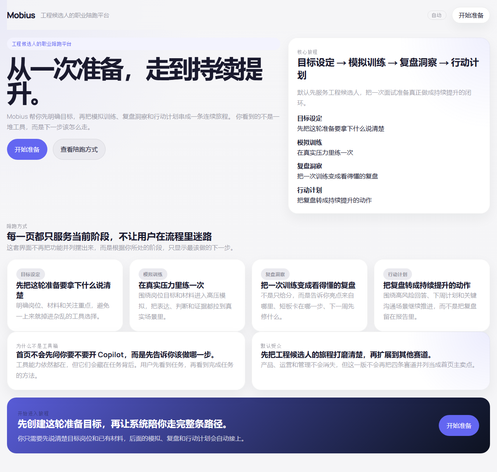

**首页包含：**

- **顶部导航栏**：品牌标识 "Mobius" + 主题切换 + "开始准备" 按钮
- **英雄区**：介绍核心旅程的四个阶段
- **陪跑方式**：详细说明每个阶段的目的
- **底部行动区**：直接开始或了解更多

---

## 2. 注册与登录

点击首页的 **"开始准备"** 按钮，进入登录/注册页面。


### 2.1 演示模式（快速体验）

不想注册？直接点击 **"进入演示"**，无需账号即可体验完整的面试模拟流程。演示模式的数据保存在本地，不会持久化。

### 2.2 注册新账号

1. 切换到 **"注册"** 标签页
2. 填写 **显示名称**（可选）、**邮箱** 和 **密码**（至少 6 个字符）
3. 点击 **"注册"**
4. 系统会发送验证邮件，确认后即可登录

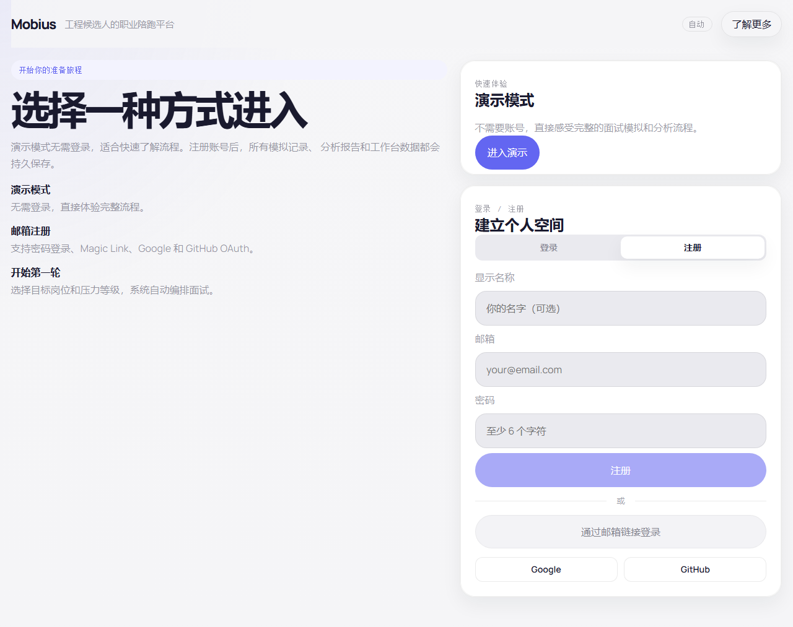

### 2.3 登录方式

| 方式 | 说明 |
|------|------|
| 邮箱 + 密码 | 填写注册时的邮箱和密码，点击 **"登录"** |
| 邮箱链接 | 输入邮箱，点击 **"通过邮箱链接登录"**，查收邮件中的登录链接 |
| Google | 点击 Google 按钮使用 Google 账号登录 |
| GitHub | 点击 GitHub 按钮使用 GitHub 账号登录 |


---

## 3. 旅程仪表盘

登录后进入 **"我的旅程"** 页面，这是你的中央控制台。系统会根据你当前所处的阶段，推荐下一步操作。


### 页面区域说明

| 区域 | 功能 |
|------|------|
| **顶部导航** | 我的旅程 / 实战演练 / 工作台 + 用户头像 + 主题切换 |
| **推荐行动卡片** | 根据当前状态显示最该做的下一步 |
| **当前概览** | 显示默认受众、当前阶段、最近更新时间 |
| **旅程阶段网格** | 四个阶段的状态卡片（目标设定 → 实战演练 → 分析洞察 → 工作台） |
| **最近进展** | 最近几次训练记录列表 |

### 旅程阶段说明

| 阶段 | 图标 | 说明 |
|------|------|------|
| **目标设定** | 📋 | 明确岗位、材料和这轮准备最想解决的问题 |
| **实战演练** | 🎯 | 在高压提问里验证表达、判断和证据质量 |
| **分析洞察** | 📊 | 把亮点和短板整理成下一步真正可执行的方向 |
| **工作台** | 🚀 | 围绕高风险问题、下周任务和关键场景持续推进 |

---

## 4. 目标设定（三步向导）

从旅程页点击 **"创建准备目标"** 或导航栏的 **"实战演练"**，进入三步向导。

### 第一步：目标岗位

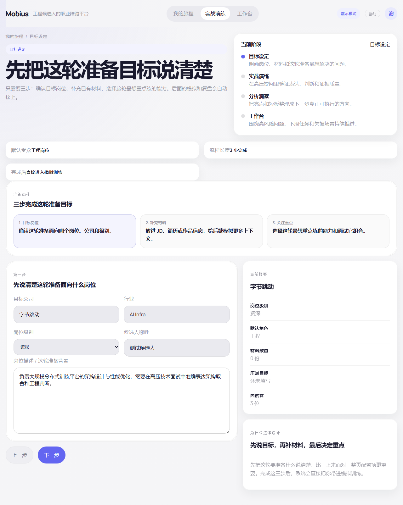

填写以下信息：

| 字段 | 必填 | 说明 |
|------|------|------|
| **目标公司** | ✅ | 你准备面试的公司名称，如 "字节跳动" |
| **行业** | ✅ | 行业方向，如 "AI Infra"、"Fintech" |
| **岗位级别** | ✅ | 选择：初级 / 中级 / 资深 / Staff / Principal / Director |
| **候选人称呼** | ❌ | 系统在模拟中如何称呼你，默认 "候选人" |
| **岗位描述** | ✅ | 写下 JD、核心职责、你最担心被问到的部分（至少 20 字） |

### 第二步：补充材料

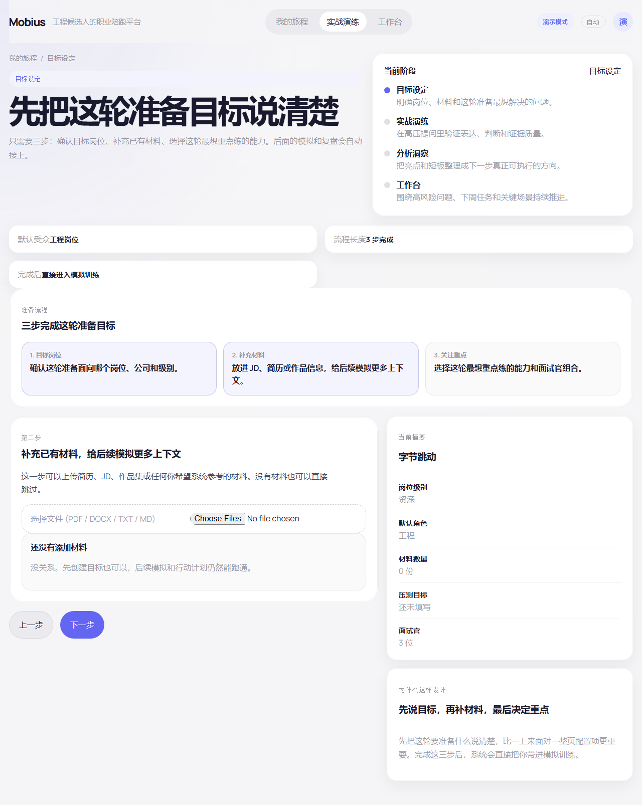

上传简历、JD、作品集等参考材料（支持 PDF / DOCX / TXT / MD）。

- 这一步可以跳过，不影响后续流程
- 每个文件最大 10MB
- 上传后系统会在模拟训练中参考这些材料

### 第三步：关注重点

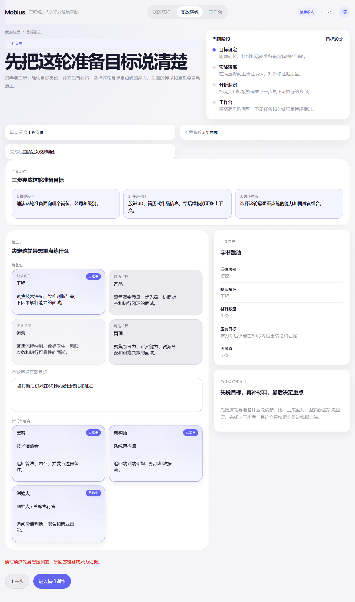

1. **选择角色包**：根据你的岗位方向选择

| 角色包 | 面试官组合 | 适合岗位 |
|--------|-----------|---------|
| **工程** | 黑客 + 架构师 + 创始人 | 技术/架构类 |
| **产品** | 战略家 + 操盘手 + 创始人 | 产品经理 |
| **运营** | 分析师 + 操盘手 + 创始人 | 运营/数据 |
| **管理** | 带人者 + 跨部门负责人 + 创始人 | 管理岗位 |

2. **填写压测目标**：写出这轮最想重点练什么，例如："被打断后仍能在 60 秒内给出结论和证据"

3. **选择面试官**：至少选一位面试官（可多选）

点击 **"进入模拟训练"**，系统会自动创建会话并跳转到模拟页。

---

## 5. 模拟训练

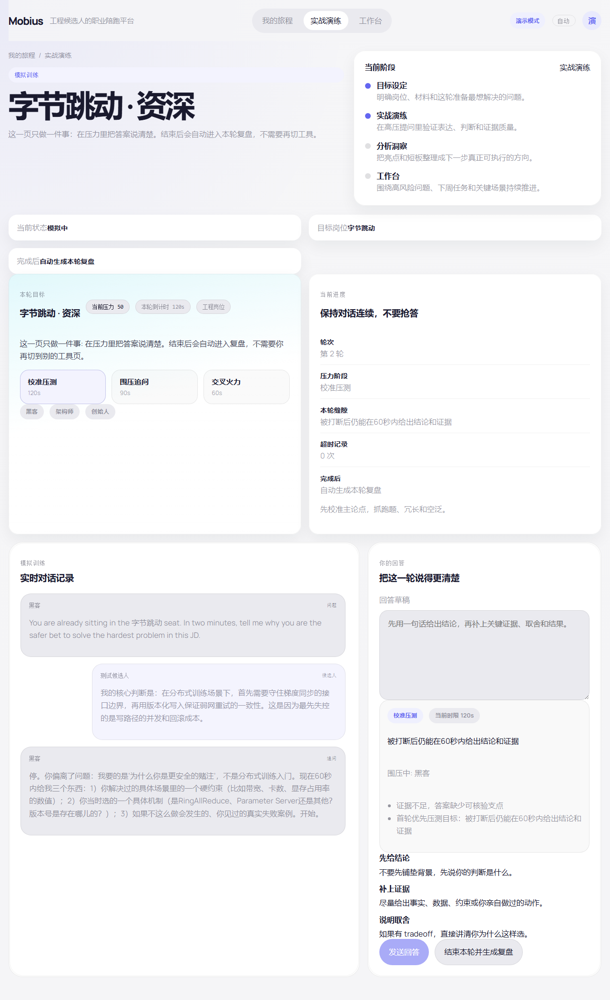

模拟训练是 Mobius 的核心体验。你将在真实的面试压力下回答问题，系统会根据你的回答实时调整追问策略。

### 页面布局

| 区域 | 功能 |
|------|------|
| **本轮目标卡片** | 显示公司、级别、当前压力值、倒计时、压力阶段 |
| **当前进度卡片** | 轮次、压力阶段、超时记录 |
| **实时对话记录** | 面试官的问题和你的回答按顺序显示 |
| **回答输入区** | 在这里编写和提交你的回答 |

### 压力阶段

模拟分为三个阶段，难度递增：

| 阶段 | 时长 | 说明 |
|------|------|------|
| **校准压测** | 120 秒/轮 | 先校准主论点，抓跑题、冗长和空泛 |
| **围压追问** | 90 秒/轮 | 多位面试官同时追问，打断和交叉质询 |
| **交叉火力** | 60 秒/轮 | 极限压力，要求在最短时间内给出结论 |

### 回答技巧

输入区下方有三条实时提示：

- **先给结论** — 不要先铺垫背景，先说你的判断是什么
- **补上证据** — 尽量给出事实、数据、约束或你亲自做过的动作
- **说明取舍** — 如果有 tradeoff，直接讲清你为什么这样选

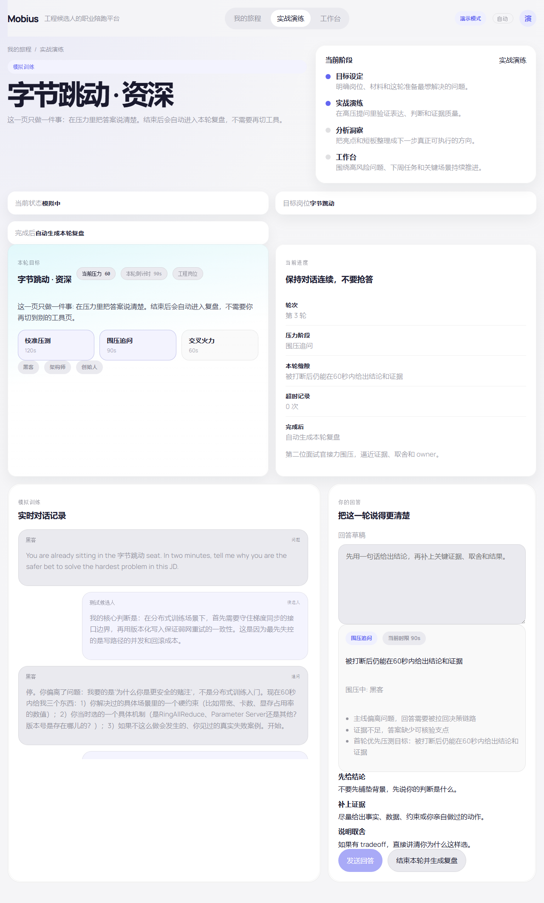

### 超时与打断

- 每轮有倒计时，超时后输入区会锁定
- 面试官会在你回答中途打断追问
- 被打断后继续回答的能力是重要的评分维度

### 结束模拟

当你觉得练够了，点击 **"结束本轮并生成复盘"**，系统会自动分析你的表现并生成报告。

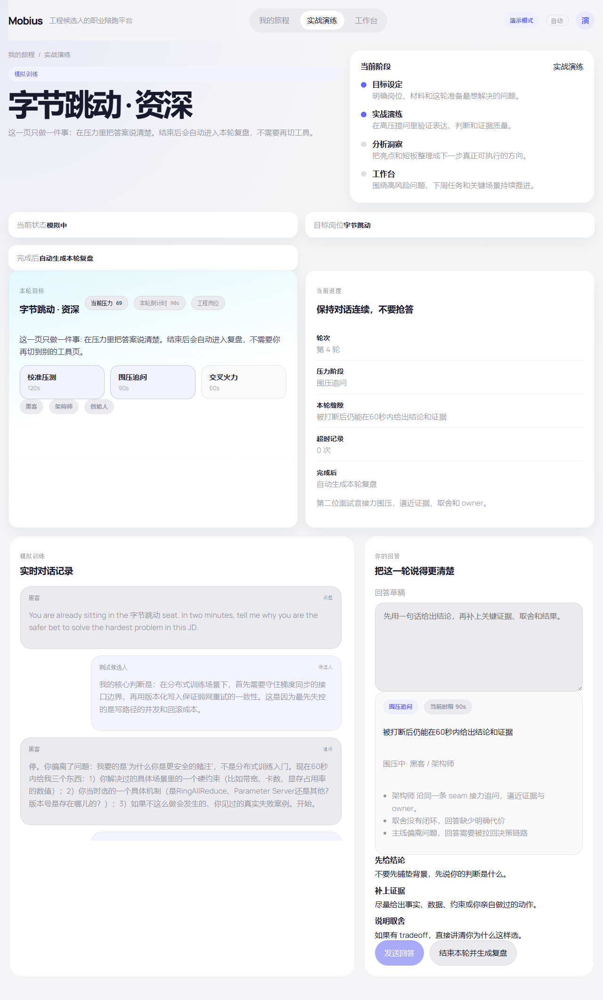

---

## 6. 复盘报告

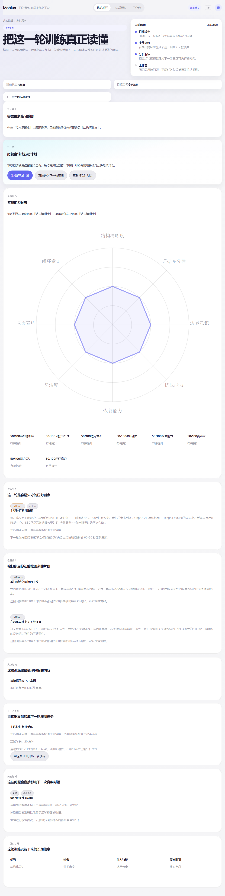

模拟训练结束后，系统自动生成复盘报告。报告不只是打分，而是把亮点、短板和行动建议整理成可执行的闭环。

### 报告区域

| 区域 | 说明 |
|------|------|
| **本轮结论** | 一句话总结你的最佳表现和最需改进的点 |
| **能力分布雷达图** | 六维能力评估，直观展示长短板 |
| **压力复盘** | 哪些压力断点最容易让你失守 |
| **恢复能力** | 被打断后你还能拉回来的片段 |
| **亮点证据** | 值得保留的优秀回答 |
| **关键短板** | 按严重程度排列的问题列表（致命/重大/中等/次要） |
| **下一次复练** | 自动生成的针对性训练计划 |
| **可复用信号** | 这轮训练沉淀下来的长期信息 |

### 能力维度

| 维度 | 说明 |
|------|------|
| 专业深度 | 技术知识的深度和准确性 |
| 问题框定 | 能否快速理解问题本质 |
| 沟通效率 | 表达是否简洁、有逻辑 |
| 压力应对 | 面对追问和打断时的稳定性 |
| 判断力 | 权衡取舍的合理性 |
| 主人翁意识 | 是否展现对结果负责的态度 |

### 生成行动计划

点击 **"生成行动计划"** 按钮，系统会：
1. 锁定本轮复盘
2. 整理重点动作
3. 打开工作台，进入后续行动

---

## 7. 工作台（职业陪跑助手）

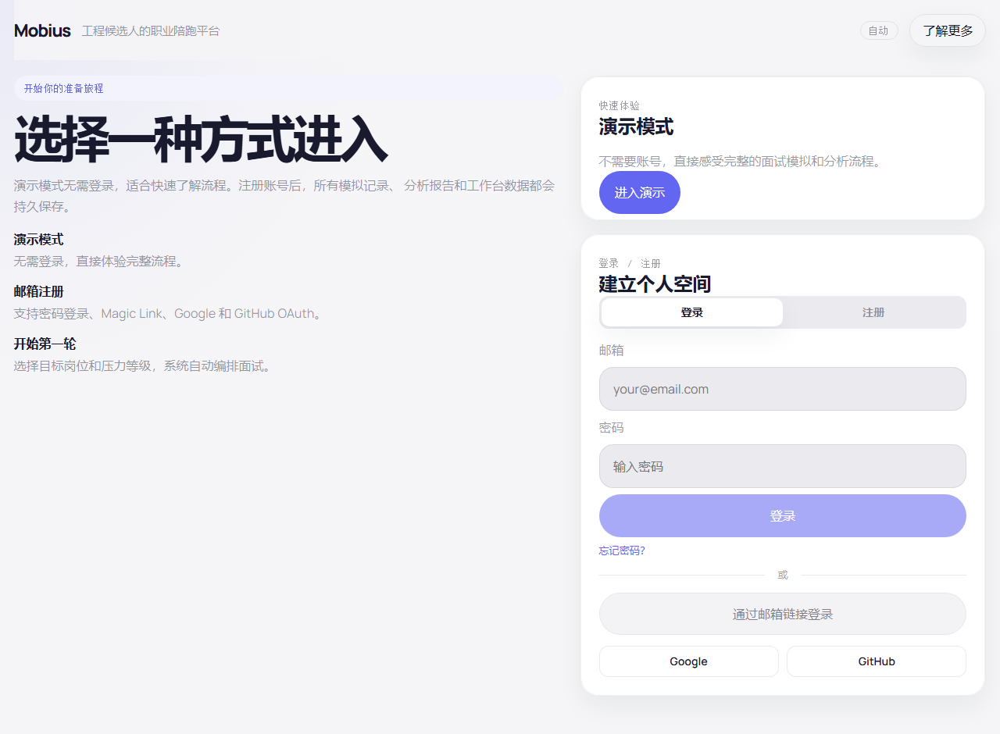

工作台是你的长期职业陪跑助手。完成面试复盘后，这里会持续跟踪你的能力提升。

### 三种模式

通过输入 `/命令` 或直接描述问题来切换模式：

| 命令 | 模式 | 用途 |
|------|------|------|
| `/copilot` | 工程调试 | 技术问题诊断、根因分析、修复方案 |
| `/strategy` | 战略研究 | 可行性研究报告、排期规划、架构设计 |
| `/sandbox` | 沟通模拟 | 职场博弈演练、谈判策略、利益相关者管理 |

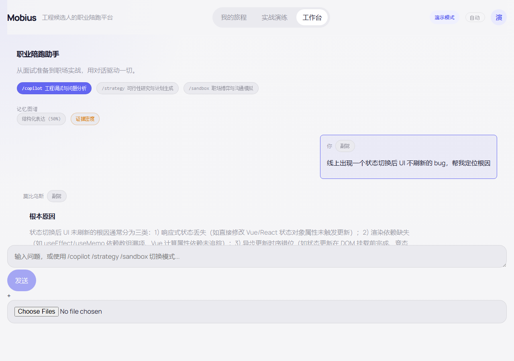

### 记忆图谱

完成面试后，系统会积累你的 **记忆图谱**，包含：
- **优势**：你反复展现的能力
- **短板**：多次训练中暴露的弱点
- **行为特征**：你的回答风格和习惯
- **高光时刻**：值得反复引用的优秀回答

### 使用方式

1. 直接输入问题，系统会自动判断你需要哪种帮助
2. 或使用 `/copilot`、`/strategy`、`/sandbox` 显式切换模式
3. 可以上传日志、文档等补充材料
4. 对话记录会保留，方便后续回溯

---

## 8. 常见问题

### Q: 演示模式和注册账号有什么区别？

| 功能 | 演示模式 | 注册账号 |
|------|---------|---------|
| 模拟训练 | ✅ | ✅ |
| 复盘报告 | ✅ | ✅ |
| 数据持久化 | ❌（刷新后丢失） | ✅（永久保存） |
| 工作台 | ✅（无记忆） | ✅（积累记忆图谱） |
| 跨设备访问 | ❌ | ✅ |

### Q: 面试官都有什么特点？

每位面试官都有不同的追问风格：

| 面试官 | 风格 | 会追问什么 |
|--------|------|-----------|
| **黑客** | 技术洁癖 | 算法、内存、并发、边界条件 |
| **架构师** | 系统思维 | 端到端架构、瓶颈、数据流 |
| **创始人** | 商业判断 | 价值判断、取舍、商业直觉 |
| **战略家** | 战略视角 | 方向选择、优先级、对齐 |
| **操盘手** | 执行导向 | 落地细节、指标、闭环 |
| **分析师** | 数据驱动 | 数据质量、归因、实验设计 |

### Q: 压力分数是怎么计算的？

系统从以下维度实时评估你的表现：
- **回答质量**：是否有结论、证据、取舍
- **时间控制**：是否在规定时间内完成回答
- **被打断后的恢复**：能否快速回到主线
- **逻辑连贯性**：前后回答是否一致

压力分数从 0 到 100，越高表示面试官施加的压力越大。

### Q: 如何切换角色包？

在旅程页面或设置页面可以切换角色包（工程 / 产品 / 运营 / 管理）。不同角色包会影响面试官组合和评估维度。

### Q: 忘记密码怎么办？

1. 在登录页点击 **"忘记密码？"**
2. 输入注册邮箱
3. 查收密码重置邮件
4. 按邮件中的链接重设密码

---

> **莫比乌斯计划** — 把一次面试准备真正做成持续提升的闭环。
